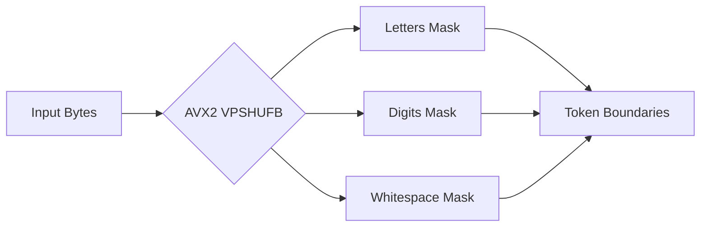
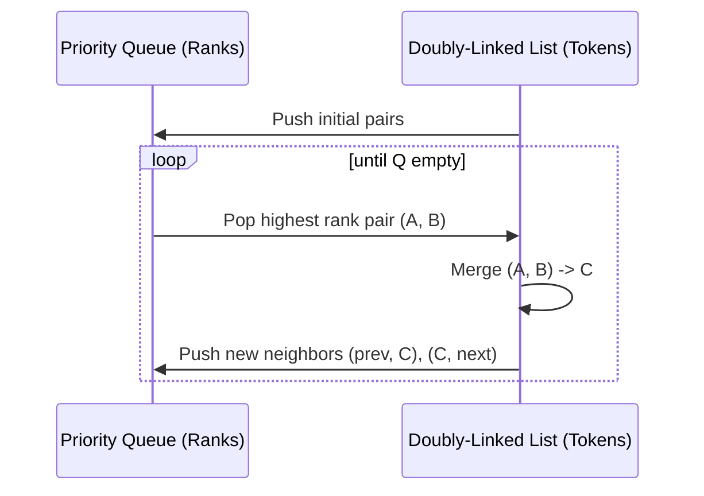

# SpeedToken 🚀

**A highly-optimized BPE tokenizer.** Designed for high-throughput batch-processing pipelines via SIMD pretokenization and cache-aware doubly-linked BPE merges.

## 📊 Performance Benchmarks

*Measured on Windows (x86_64, AVX2, 16 Threads) using cl100k_base. MT denotes Rayon-parallel batch encoding.*
*Disclaimer: The comparison against `tiktoken` includes Python API boundary overhead. SpeedToken MT processes batches natively across threads, conferring an architectural scaling advantage outside Python's GIL.*

<!-- BENCHMARK_TABLE_START -->
| Corpus | Method | Throughput (MB/s) | Tokens/sec |
| :--- | :--- | :--- | :--- |
| **Wikipedia** | **SpeedToken (MT)** | **38.19** | **12,803,354** |
| | SpeedToken (ST) | 13.94 | 4,673,539 |
| | rs-bpe (MT) | 14.07 | 4,718,085 |
| | rs-bpe (ST) | 13.17 | 4,413,433 |
| | Tiktoken | 4.85 | 1,627,100 |
| **JSON** | **SpeedToken (MT)** | **30.31** | **21,230,938** |
| | SpeedToken (ST) | 14.72 | 10,309,400 |
| | rs-bpe (ST) | 7.03 | 4,921,177 |
| | Tiktoken | 2.09 | 1,461,528 |
| **Code** | **SpeedToken (MT)** | **29.21** | **9,791,058** |
| | SpeedToken (ST) | 12.85 | 4,307,746 |
| | Tiktoken | 4.12 | 1,380,046 |
<!-- BENCHMARK_TABLE_END -->

## 🛠️ How It Works

### 1. SIMD Pretokenization
Uses AVX2 `VPSHUFB` instructions for parallel byte classification. As an alternative to regex matching, we classify 32-byte chunks simultaneously into categories (letters, digits, whitespace, etc.) to identify token boundaries. Native fallbacks are implemented for ARM NEON and scalar processors.



### 2. O(N log V) Doubly-Linked BPE
Replaces an $O(N^2)$ scan loop with an arena-allocated doubly-linked list coupled with a min-priority queue for merge candidates. This bounds the overhead of each operation, achieving $O(N \log V)$ worst-case behavior (where $V$ is active pairs) across long sequences.



### 3. Rayon Parallel Batching
Leverages Rust's Rayon library to parallelize encoding across multiple CPU cores. Each core maintains its own thread-local scratch arena and pair-cache, enabling massive scaling without lock contention.

## 🔒 Compatibility Guarantee

SpeedToken is validated to be **100% bit-for-bit compatible** with `tiktoken` on `cl100k_base`. The test suite strictly validates consistency regarding complex Unicode edges, lone surrogate extraction, and precise whitespace drops.

## ⚖️ Tradeoffs & Known Limitations

- **Latency vs Throughput**: Optimized primarily for extensive batch-throughput routines. Small or single-string inputs may exhibit higher overhead latency due to thread-pool dispatch costs.
- **Cache Architecture**: The doubly-linked list strategy accelerates logic complexity but sacrifices spatial data locality (pointer chasing) compared to array compaction strategies.
- **Initialization**: Spinning up Rayon and allocating localized memory arenas incurs a detectable cold-start cost, demanding persistent processes rather than short-lived functions.

## 🚀 Quick Start


### Installation

```bash
pip install speed_token
```

### Usage

```python
from speed_token import SpeedToken

# Load cl100k_base (GPT-4) vocabulary
ft = SpeedToken("path/to/cl100k_base.tiktoken", "cl100k_base")

# Encode a single string
tokens = ft.encode("Hello world! 🚀")
print(tokens)

# Decode tokens back to bytes
bytes_out = ft.decode(tokens)
print(bytes_out.decode('utf-8'))

# Batch encode with Rayon parallelism
texts = ["First sentence", "Second sentence", "Third sentence"]
batch_tokens = ft.encode_batch(texts)
```

## 📜 License
MIT
